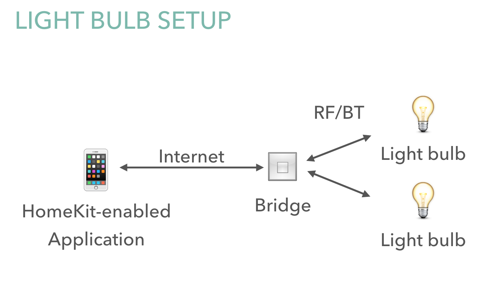
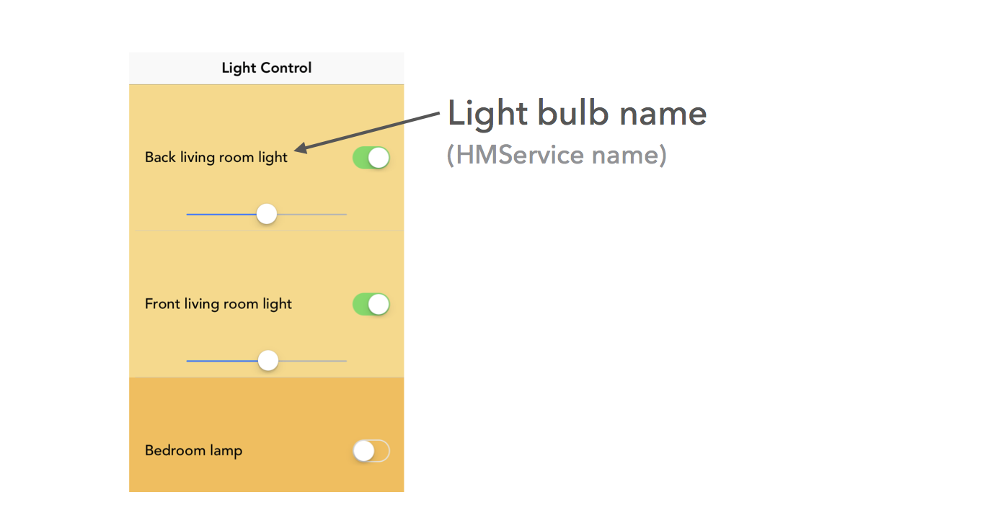
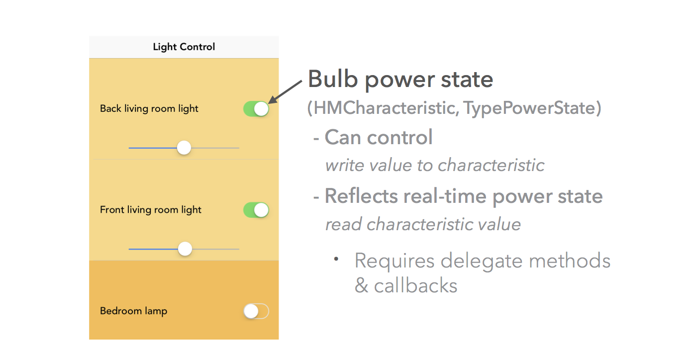
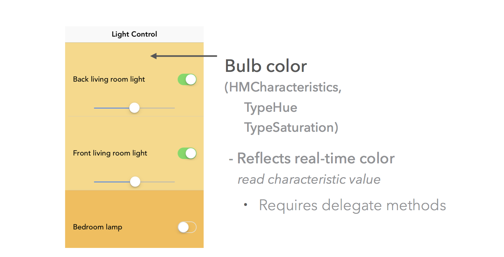

# HomeKitFun

This is a sample app to start exploring a pre-setup Home (with HomeKit database) that has light bulbs connected via HomeKit. This app currently only explores light bulb services of accessories in the Home.

## Prerequisites
This app depends on a pre-defined Home, already setup and with a HomeKit database. If you do not have a Home set up yet, you'll need to do so with another app. I used the [Philips Hue app](itunes.apple.com/app/id557206189) to set mine up. Another option is [Elgato Eve](itunes.apple.com/app/id917695792), which I've also used. 

Apple does not have an official 'Home' app, so you'll need to use a 3rd party app like one of the aforementioned apps to set your home up. There are plenty of apps to help with the setup.

## Home Setup
This is the home configuration I have, just for reference. I have Philips Hue light bulbs, connected to a Philips bridge over RF/BT, which is HomeKit-enabled and can communicate with a HomeKit-enabled app over IP. 

You can setup any brand of light bulbs, on any type of accessory, and have a bridge or no bridge (depending on manufacturer). As long as there's a way for the light bulbs to connect to HomeKit (directly via an accessory or indirectly via a bridge), the app *should* work with any light bulb accessories.

## The App

Assuming you've setup your home, and have access to the HomeKit database, the app will connect to the primary home and find light bulb services.

It will display:

- The light bulb names (per the Home configuration).
- The current brightness of the bulbs, as indicated by a slider.
- The current power state of the bulbs, as indicated by a switch.
- The current reachability of the bulbs, as indicated by the switch enablement. If any light bulb is unreachable, the power switch will be disabled (grayed out).
- The current light bulb hue / saturation, as indicated by the table cell background color.

You can control:

- The brightness via the slider.
- The power state via the switch (assuming the bulb is reachable).

### Screenshots

